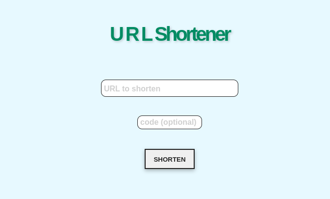
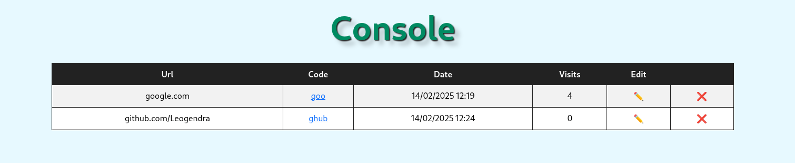

# URL Shortener

A minimalist URL shortener based on **Node.js** and **MongoDB**.

## Features
- Shorten a URL
- Customize the shortened code
- Check the availability of a code
- Admin panel protected by authentication
- Delete and update shortened URLs
- Store URLs and visit statistics

## Prerequisites
- **Node.js** (recommended version: 14+)
- **MongoDB** (database for storing URLs) : Create a database and get the connection URI
- A `.env` file containing environment variables:
  ```env
  PORT=3000
  MONGO_URI=Your_MongoDB_Connection
  CREDENTIAL_NAME=admin
  CREDENTIAL_PASS=adminpassword
  ```

## Installation
1. **Clone the repository**

2. **Install dependencies**:
   ```sh
   npm i
   ```

3. **Start the application**:
   ```sh
   npm run dev
   ```
   The server now runs on `http://localhost:3000`

## Usage
- Enter the URL you want to shorten in the input field and click on the `Shorten` button. You can customize the shortened code by entering it in the `Custom Code` field.
- To accès the **Admin panel**, click the "URL"


